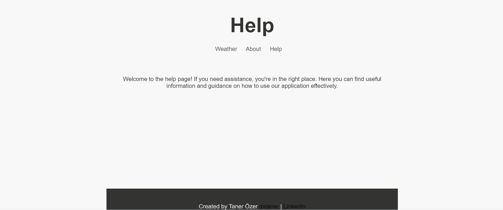

# Weather Application

This simple weather application allows users to get weather information for a specific location. The application is a web application created using Express.js and provides weather data using Map APIs.

## Screenshots


## Installation

1. First, clone this repository:

    ```bash
    git clone https://github.com/dxtaner/nodejs-weather-app
    ```

2. Navigate to the project directory:

    ```bash
    cd weather-application
    ```

3. Install the required packages:

    ```bash
    npm install
    ```

4. Run the application:

    ```bash
    npm start
    ```

5. Go to `localhost:3000` in your browser and start using the application!

## Usage

- The homepage, under the title "Weather", provides an interface for the user to get weather information.
- The "About" page provides information about the developer of the application.
- The "Help" page provides guidance on how to use the application.
- The "Weather" page fetches and displays weather information for a specific location.

## API Usage

The application utilizes map and weather APIs such as [Mapbox](https://www.mapbox.com/) and [Weatherstack](https://weatherstack.com/).

## Contributing

This project is open to contributions. If you wish to contribute, please open a pull request or file an issue.

## License

This project is licensed under the MIT License. See the `LICENSE` file for more information.
